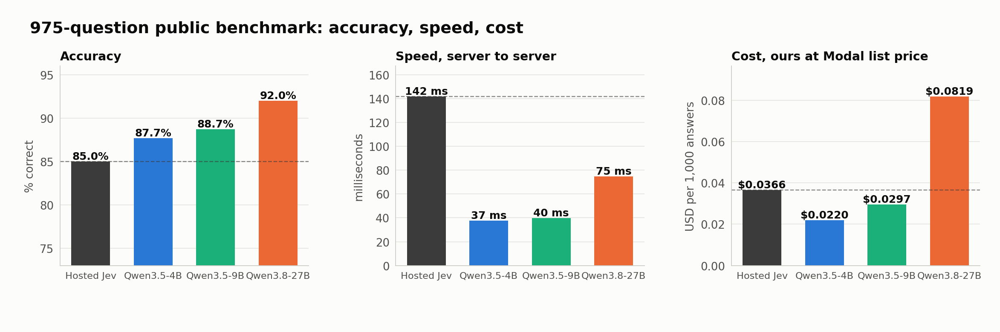
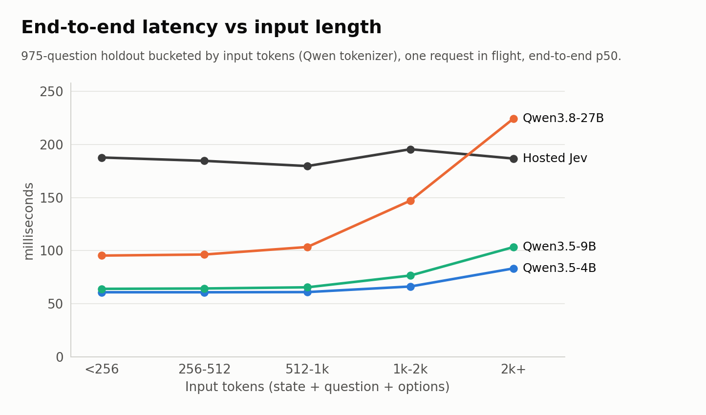
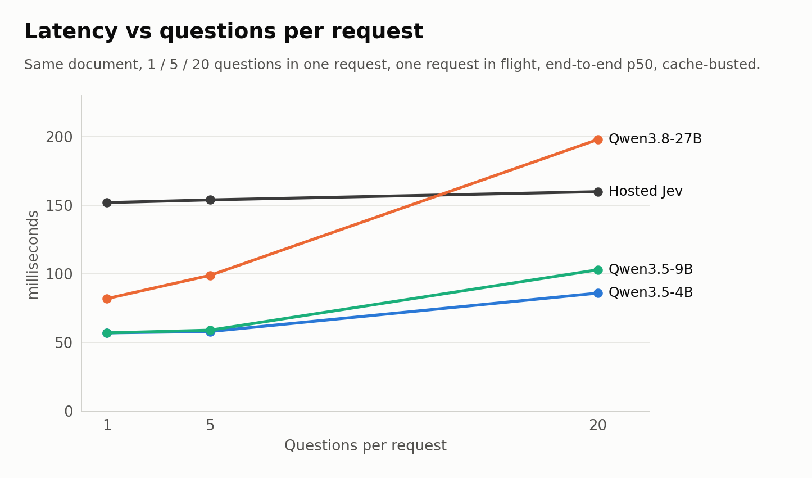
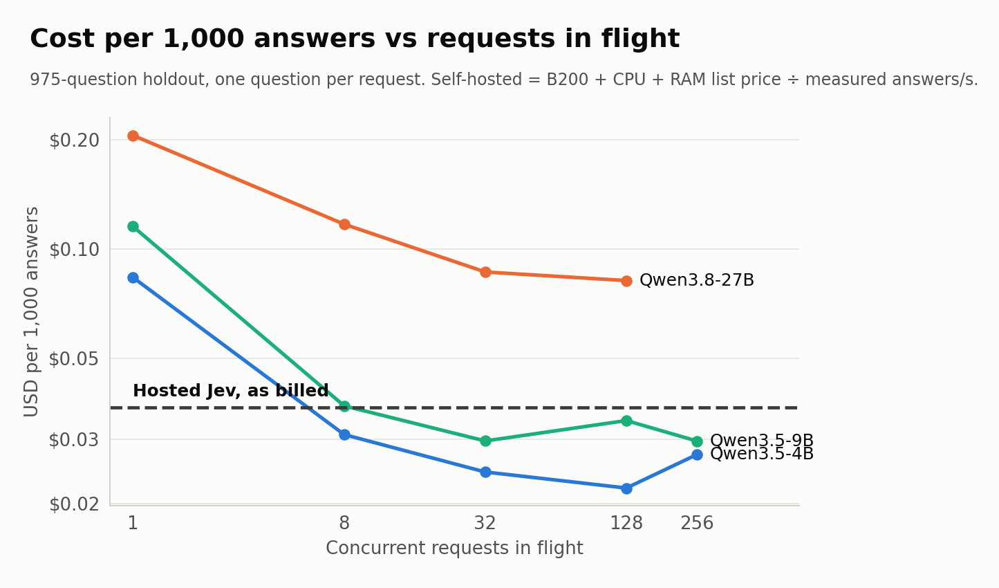
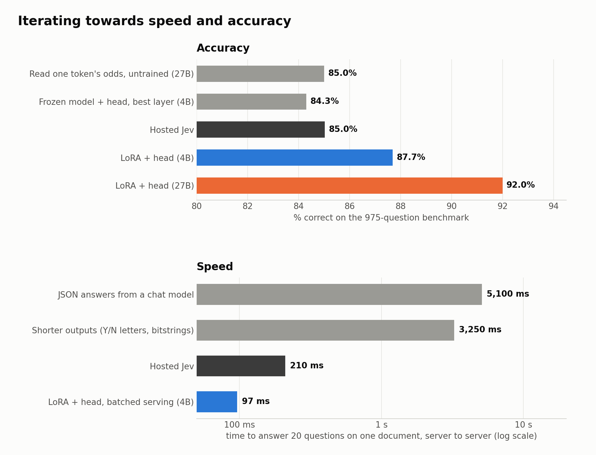
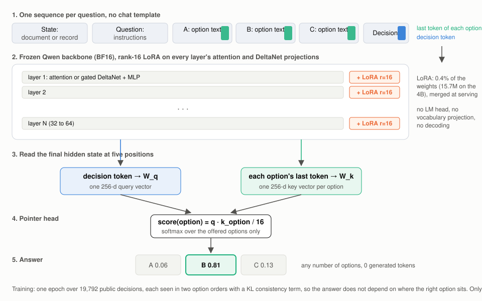
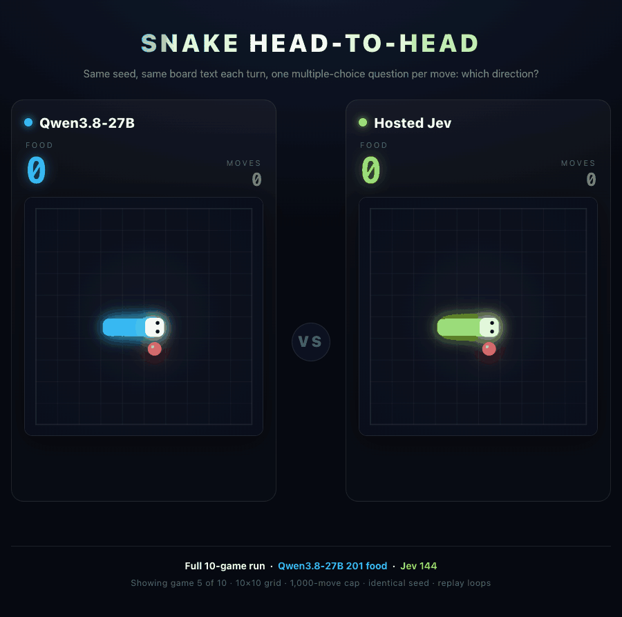

# Rev: Beating Jev on accuracy, speed, and cost
[human-written]
Rev is a set of 3 decision models based off Qwen which beat Jev across multiple public benchmarks on speed, cost, and accuracy.

The models, training data, and train scripts are available here.



## The benchmark

**Hosted against hosted, measured the same way.** Both systems are called over HTTPS from the same cloud client (a Modal container in us-west). Our models run as Modal web endpoints on one B200 each; Jev is `typesafe/jev-1.13` through OpenRouter. Every latency in this post is end to end: what that client sees from sending the request to receiving the answer, including network, tokenization and the model forward, with one request in flight. Cost is per 1,000 answers: Jev as billed by OpenRouter, ours at Modal's B200 list price (GPU plus provisioned CPU and RAM) divided by the answers per second we measured at full load, so it is the cost of a busy GPU with no idle time.

**The test set** is 975 questions drawn from five public reading and reasoning datasets, frozen in [`eval_sets/public_holdout_975.jsonl`](eval_sets/public_holdout_975.jsonl) with its checksum. Every question has the same shape Jev's API uses: a state (the document), instructions (the question) and criteria (the options), and the label is the dataset's own answer. None of it was used for training: the training set excludes these questions by id and by source document.

| Source | Questions | Task | Options | Input length |
|---|---:|---|---:|---|
| ContractNLI | 175 | Does this NDA support, contradict, or not mention a claim? 53 real non-disclosure agreements, the 17 standard claims each. | 3 | 500 to 3,600 tokens, median 2,000 |
| RACE | 200 | Reading comprehension from English exams: a passage and a question about it. | 4 | 300 to 550 tokens |
| CosmosQA | 200 | Commonsense reading of short first-person narratives: why something happened, what happens next. | 4 | 100 to 250 tokens |
| MultiRC | 200 | Multi-sentence reading comprehension: is this candidate answer to a question about the passage correct? 83 passages. | 2 | 200 to 650 tokens |
| Social IQa | 200 | Social commonsense about a one- or two-sentence situation: motivations, reactions, what comes before. | 3 | 50 to 100 tokens |

So the set spans two-line situations to 3,600-token contracts, yes/no to four-way choices, and three kinds of reasoning. The multi-question test further down uses a separate set of four synthetic invoices with 20 yes/no questions each.

### Accuracy, speed, cost

| Model | Accuracy | Speed (end to end) | Cost per 1k |
|---|---:|---:|---:|
| Hosted Jev | 85.0% | 142 ms | $0.0366 |
| Qwen3.5-4B | 87.7% | 37 ms | $0.0220 |
| Qwen3.5-9B | 88.7% | 40 ms | $0.0297 |
| Qwen3.8-27B | 92.0% | 75 ms | $0.0819 |

95% intervals are about plus or minus 2 points, so the 4B is at the edge of a tie and the 9B and 27B are clearly ahead. All four systems were measured in one run from one client (`results/holdout/`); Jev's accuracy moves by a few questions between runs (84.7% to 85.2% across ours) and every system's latency moves with where the client container lands, so compare within a table, not across runs. For the record, on Jev's own published set of 102 workflow questions Jev still leads, 91 to 88; the full numbers are in [`results/`](results/).

### Speed by input length

Same run, bucketed by input tokens. Jev is flat at every length; ours grow with the document. The 4B and 9B stay under Jev all the way up to the longest contracts; the 27B crosses Jev above 2,000 tokens.



| Model | under 256 tokens | 256 to 512 | 512 to 1k | 1k to 2k | over 2k |
|---|---:|---:|---:|---:|---:|
| Hosted Jev | 140 ms | 141 ms | 144 ms | 144 ms | 150 ms |
| Qwen3.5-4B | 37 ms | 37 ms | 38 ms | 44 ms | 63 ms |
| Qwen3.5-9B | 39 ms | 39 ms | 40 ms | 52 ms | 76 ms |
| Qwen3.8-27B | 74 ms | 74 ms | 75 ms | 113 ms | 196 ms |

### Speed by questions per request

Jev's API takes several questions about one state in a single request, so we tested that too: four synthetic invoices, 1, 5 or 20 yes/no questions each, every request carrying a fresh reference id so neither side can serve it from a cache. Jev's latency is flat in the number of questions. Ours grows, but the 4B and 9B answer 20 questions in half Jev's time and the 27B matches it. This run's client sat farther from every server than the load test's, which is why Jev's one-question time reads 191 ms here and 142 ms above.



| Model | 1 question | 5 questions | 20 questions |
|---|---:|---:|---:|
| Hosted Jev | 191 ms | 203 ms | 210 ms |
| Qwen3.5-4B | 64 ms | 65 ms | 97 ms |
| Qwen3.5-9B | 64 ms | 69 ms | 111 ms |
| Qwen3.8-27B | 100 ms | 107 ms | 218 ms |

### Cost under load



Our costs are at Modal's list price ($7.39 an hour for a B200 with its CPU and RAM). At the cheapest on-demand B200 we found elsewhere, $5.98 an hour on RunPod, the 4B is $0.0178 per 1,000 answers, half of Jev's price, and the 27B is $0.0662. All providers compared: [`results/holdout/GPU_PRICES.md`](results/holdout/GPU_PRICES.md).

### A third-party benchmark: JevBench

[JevBench](https://benchmarkheaven.com/jev-models) is Benchmark Heaven's suite for Jev-class models: 534 decisions in four tiers, authored fresh by two frontier models and frozen before any system ran. 231 of them are public; the rest, including the whole judge tier, are held back and only the site can score them. We scored the 231 public items with the site's own scoring rules on our server and did not submit anything. Nothing from JevBench went into training, and an overlap check against the training set found zero hits.

| System, on the same 231 public items | Accuracy | Hard tier | Intelligence axis | Calibration axis |
|---|---:|---:|---:|---:|
| Qwen3.8-27B (this repo) | 89.6% | 79.3% | 86.2 | 80.6 on the public hard items |
| Hosted Jev 1.13 | 86.6% | 73.0% | 82.3 | 82.7 on the full hard tier |
| Best other open reconstruction (reflex-27b) | 87.0% | 75.7% | 82.4 | |
| Best 4B on the board (SemIf, Qwen3.5-4B) | 81.0% | 61.3% | 74.9 | |
| Qwen3.5-4B (this repo) | 78.4% | 59.5% | 70.6 | 75.4 on the public hard items |
| Frontier chat models (GPT-5.6, DeepSeek V4.1) | 97 to 98% | 96% | 96 to 97 | |

Our first 27B scored 85.7% here, a point behind Jev. Reading its 33 misses showed that 14 of them copied the conclusion of a wrong human note planted in the state, and that the untrained backbone was better than our fine-tune at date and number arithmetic. So we generated 6,285 synthetic decisions of those shapes (long policies with lookups, date and quantity arithmetic, multi-hop records, routing, traps, yes/no and ordered-level questions), every label derived by rule from the generated facts and a wrong "helpful note" planted on purpose, and retrained the 27B on the public mix plus those. That retrain is the 27B in every table above: JevBench rose to 89.6% and the 975-question holdout went from 91.1% to 92.0%. Calibration is a single temperature fitted on the synthetic dev split and stored in each checkpoint (1.70 for the 27B, 1.96 for the 4B); it changes no choices and took the 27B's calibration axis from 71.9 to 80.6. The 4B got the same synthetic mix and lands two points behind the best 4B on the board on these items; its misses are long policies, date arithmetic and trade-offs, where a 4B in one forward pass runs out of room. The site's composite score also weighs speed and cost from its own serial measurement, which only a submission can produce.


## The journey

<!-- ROB: this section is yours. It should read as written by hand, and the first line should say so. The notes below are the facts in order, with the numbers, to write from or to delete. -->



Notes to write from:

- **JSON on hosted models.** Asked hosted chat models for named JSON answers. Accuracy was fine (on 160 matched invoice decisions, hosted Qwen got 154 right to Jev's 147), but every answer is generated serially: a 20-question request took 5.10 s against Jev's 0.27 s, and cost 15x more per decision.
- **Compact outputs.** Generate less: integer arrays, spaced Y/N letters, bitstrings. Accuracy fell (97.5% for JSON, about 92% for arrays, 85 to 87% for letters, 56 to 66% for bitstrings) and latency did not improve (3.25 s for JSON, 4.00 s for bitstrings). Priority routing on hosted providers did not get near Jev either.
- **First-token letter logits.** Stop generating: put the options in the prompt and read the logits of the answer letters at one position. Zero training, Qwen3.8-27B at about 85% on the benchmark, Qwen3.5-9B at 80%. Fast, but sensitive to option order, and packing several questions into one sequence let later questions see earlier ones.
- **Head only.** Freeze Qwen3.5-4B, cache hidden states, train a pointer head in about 10 seconds per configuration. Best single layer (18 to 20 of 32) reached 84.3%; the final layer only 80.6%; learned mixes over layers did not beat the best single layer. Out of distribution (Jev's own workflow questions) it collapsed to 58 to 74 of 102.
- **LoRA plus head.** Adding a rank-16 adapter on the attention and DeltaNet projections was the win: 87.6% on the benchmark and 87 of 102 on Jev's questions. The first trained version already matched Jev's accuracy at lower latency, but at one request in flight the 9B cost 4.1x more than Jev per answer. The model was fine; the serving was the problem.
- **Speeding it up.** torch.compile with CUDA graphs cut 20-question compute from 116 ms to 67 ms in an early test but needs fixed shapes and flipped a few near-tied answers, so the final server runs eager. What actually moved cost below Jev: one row per question, batched across requests, which takes a GPU from 40% busy to near 100%. Then a shared-context path for many questions on one long document (prefill once, fork the cache per question), chosen per request by a cost model the server calibrates at startup.

## Honestly

This is all Claude Code and GPT plus minor intuition. An ordinary guy reverse engineered a well-funded startup's flagship model in about three days, for less than a few hundred dollars of GPU time, without their weights, their data or their team. What was needed was their public API contract, public datasets, two coding agents and a credit card.

That is the bombshell, and it is worth being precise about what it means. We did not steal anything. We rebuilt the product from its description, which is worse news for anyone whose pitch is the model. The model was never the moat. What is left as a moat is the idea, the developer mindshare from a great launch, the eval set, and the API contract people build against. Every "we trained a small specialized model" company should read this the same way: the model is a weekend, the distribution is the company.

Jev is pretty amazing as a concept and idea. It moved things forward and they had an amazing launch. It clearly caught the attention of developers, which is exactly what it should do. They're going to get cloned, copied, and beaten, but maybe it doesn't matter because they're top of mind.

## How it works



**Model.** Qwen3.5-4B, Qwen3.5-9B and Qwen3.8-27B, frozen, with a rank-16 LoRA on every layer's attention and DeltaNet projections and a 256-d pointer head. The head scores each option's last token against the decision token and takes a softmax over the offered options only, so any number of options works and nothing is decoded.

**Training.** One epoch over 19,792 public decisions ([`data/train.jsonl.gz`](data/train.jsonl.gz)), with the benchmark's questions and documents excluded; the 4B and 27B additionally see 6,285 synthetic decisions with rule-derived labels ([`data/synth_jevbench.jsonl.gz`](data/synth_jevbench.jsonl.gz), generated by `synth_jevbench.py`). Each example is seen in two option orders with a KL consistency term, so the answer does not depend on where the right option sits. One B200 per model: 63 minutes for the 4B and 150 for the 27B on the larger mix, 33 for the 9B on the public set alone.

**Serving.** One Modal server per model with the LoRA merged into the weights and cross-request dynamic batching: every question is one row, rows from all in-flight requests are sorted by length and run together, which is what takes the GPU from 40% busy to nearly 100% and puts our cost below Jev's. A request with several questions on one long document is served by prefilling the document once and forking the cache per question, and the server picks that path or plain rows per request from a cost model it calibrates at startup.

**Kev.** Credit where it is due: [Kev](https://github.com/jaredpalmer/kev) by Jared Palmer was the first open reconstruction of Jev, and it is where the recipe comes from. Kev put a rank-16 LoRA and a pointer head on Qwen3.5-Base, published the weights, the training code and the serving path, and showed that a small open model can play Jev's game at all. We started from that recipe and changed the parts that limited it: Kev trains on about 12.6k short decisions and rejects states over 384 tokens, so it cannot read a contract; ours trains on states up to 4,096 tokens in two option orders, goes up to 27B, and gets its speed and cost from the batched serving stack rather than the model. With Kev's length guard lifted, Kev-9B scores 76.5% on our benchmark, which is what you would expect from a model that never saw a long document in training, and it beats us on the short classification tasks it was built for.

## Run it

Weights (LoRA adapters plus pointer head, about 60 MB for the 4B and 200 MB for the 27B) are on Hugging Face: [`robbalian/rev-qwen3.5-4b`](https://huggingface.co/robbalian/rev-qwen3.5-4b), [`robbalian/rev-qwen3.5-9b`](https://huggingface.co/robbalian/rev-qwen3.5-9b), [`robbalian/rev-qwen3.8-27b`](https://huggingface.co/robbalian/rev-qwen3.8-27b). `serve_local.py` is a plain FastAPI server with no Modal dependency: it pulls the pinned Qwen base from the Hub, merges the adapter, and serves the same `/score` contract as the benchmarks used.

```bash
pip install torch transformers fastapi uvicorn huggingface_hub
python serve_local.py --repo robbalian/rev-qwen3.5-4b --port 8000
```

```bash
curl -s localhost:8000/score -H 'content-type: application/json' -d '{
  "state": {"invoice_total": 1250, "po_total": 1000, "vendor": "Acme"},
  "questions": [{"id": "approve", "instructions": "Should this invoice be approved without review?",
                 "criteria": {"yes": "Approve as is", "no": "Send to review"}}]}'
```

The answer comes back as a choice and a probability per option, with zero generated tokens. Any number of options works.

## Reproduce

Everything runs on [Modal](https://modal.com); the only secret is an OpenRouter key in a Modal secret named `openrouter` for the Jev arm.

| File | What it does |
|---|---|
| `train.py` | Trains the LoRA and pointer head for the 4B, 9B and 27B on one B200 each, from `data/train.jsonl.gz`, holding out `eval_sets/public_holdout_975.jsonl`. |
| `server.py` | The Modal server: merged weights, dynamic batching, the shared-context path with calibrated routing, and a slow-host guard. `modal deploy server.py`. |
| `loadtest.py` | Every model over the 975-question benchmark at each concurrency level, from a cloud client; `report.py` and `charts.py` turn it into the tables and charts. |
| `multiq.py` | The 1, 5 and 20 questions per request test, with cache-busting; `report_multiq.py` summarizes it. Cases in `cases/`. |
| `external_eval.py` | Scores Jev's own published 102 workflow questions (plus a 160-question public slice) against Jev's saved answers in `results/jev_official_answers.jsonl`. |
| `head_only.py` | The frozen-backbone ablation and layer sweep. |
| `synth_workflows.py`, `train_synth.py` | Official-style synthetic workflow packets and the warm start on them. |
| `kev_eval.py` | Kev's released checkpoints through their own serving path. |
| `refresh_numbers.py`, `post_charts.py` | Build `post/numbers.json` from one load-test run and one multi-question run, then draw the charts in this README. |
| `serve_local.py`, `publish_weights.py` | Serve a checkpoint anywhere without Modal; package a training run into a Hugging Face repo with a model card. |
| `synth_jevbench.py` | Generates the synthetic decisions (long policies, date and quantity arithmetic, multi-hop records, routing, traps, yes/no and ordered-level questions) with rule-derived labels and an overlap check against every eval set. |
| `snake_arena.py`, `snake_vision.py`, `snake_replay.py` | The Snake arena (text and image boards) and its replay pages; see below. |
| `eval_sets/` | The frozen evaluation sets with checksums. Nothing in them was used for training. |
| `results/` | The full load-test report with every concurrency level, the cache-busted multi-question runs, Jev's official-set results, and the Snake arena summary. |

## Snake

For fun, and because a decision model should be able to play a game one multiple-choice question at a time: each turn the player gets the board and is asked which direction to move. Same seeds for everyone, 10 games, a 1,000-move cap. Qwen3.8-27B ate 201 food, Hosted Jev 144, Qwen3.5-4B 114, Qwen3.5-9B 109. This is game 5, where Jev runs into itself at move 38 and the 27B keeps going to 185.



Live replay with all ten games: [`results/snake/replay.html`](results/snake/replay.html). The head-to-head above: [`results/snake/headtohead.html`](results/snake/headtohead.html).

**It takes images too.** The backbone is a vision-language model, so the same text-trained LoRA and head can be handed the board as a PNG instead of text, with no coordinates anywhere in the prompt. Nothing was retrained for this. Under a 200-move cap the 27B ate 66 food from the image board over 10 games against 173 to 189 from the text board, so it plays worse from pixels but it plays, with a head that never saw an image during training. Jev is text only, so there is no Jev number here. Details in [`results/snake/vision/`](results/snake/vision/).
