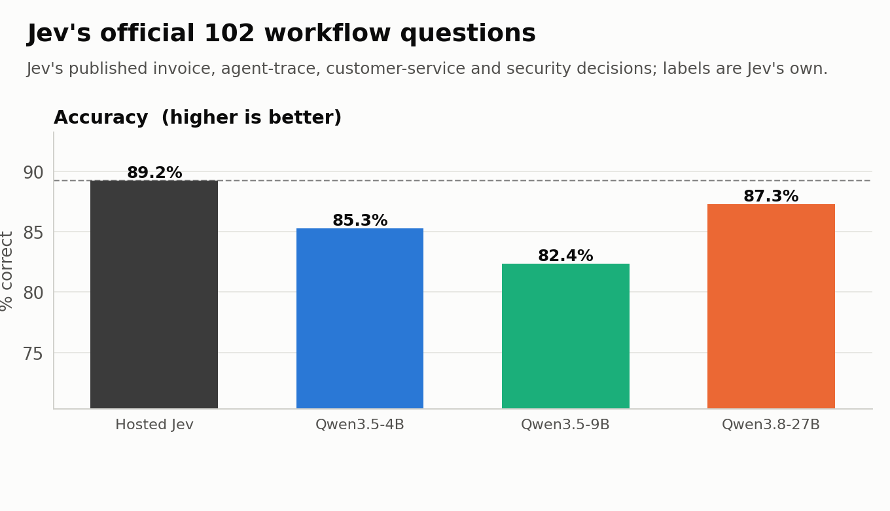

# Rev: Beating Jev on accuracy, speed, and cost

Rev is a set of open-weight decision models: a Qwen backbone with a rank-16 LoRA and a small pointer head that picks one of the offered options without generating a token. On the same 975-question public holdout, Qwen3.5-4B and Qwen3.5-9B are more accurate than Hosted Jev, answer in a third of the time, and cost 1.3x to 1.8x less per answer at load. Jev still leads on its own official set by a few questions. One person and two coding agents built this in about three days.

## Benchmarks

**Everything here is hosted against hosted, measured the same way.** Both systems are called over HTTPS from the same cloud client (a Modal container in us-west): our models run as Modal web endpoints on one B200 each, and Jev is `typesafe/jev-1.13` through OpenRouter. Speed is the end-to-end p50 seen by that client with one request in flight, including network, tokenization and the model forward. Cost is per 1,000 answers: Jev as billed by OpenRouter, ours at Modal's B200 list price (GPU plus provisioned CPU and RAM) divided by the answers per second we measured at full load. Ours excludes idle time, so it is the cost of a busy GPU. Every table has the same three columns in the same order: accuracy, speed, cost.

### 975-question public holdout

ContractNLI, RACE, CosmosQA, MultiRC and Social IQa questions that none of our models trained on. Same questions, options and labels for every system. Inputs run from about 60 to 2,900 tokens.


| Model | Accuracy | Speed | Cost per 1k |
|---|---:|---:|---:|
| Hosted Jev | 84.7% | 187 ms | $0.0366 |
| Qwen3.5-4B | 87.6% | 61 ms | $0.0209 |
| Qwen3.5-9B | 88.7% | 65 ms | $0.0286 |
| Qwen3.8-27B | 91.1% | 97 ms | $0.0821 |

95% intervals are about plus or minus 2 points, so the three models are ahead of Jev on accuracy, not tied.

Speed by input length, from the same run. Jev is flat; ours grow with the document, and the 4B and 9B stay under Jev at every length.


| Model | under 256 tokens | 256 to 512 | 512 to 1k | 1k to 2k | over 2k |
|---|---:|---:|---:|---:|---:|
| Hosted Jev | 188 ms | 185 ms | 180 ms | 195 ms | 187 ms |
| Qwen3.5-4B | 61 ms | 61 ms | 61 ms | 66 ms | 83 ms |
| Qwen3.5-9B | 64 ms | 64 ms | 65 ms | 77 ms | 103 ms |
| Qwen3.8-27B | 95 ms | 96 ms | 103 ms | 147 ms | 224 ms |

### Jev's official 102 workflow questions

Jev's published invoice, agent-trace, customer-service and security decisions. The labels are Jev's own (strong-model consensus, not human ground truth), and this set is out of distribution for us.



| Model | Accuracy | Speed | Cost per 1k |
|---|---:|---:|---:|
| Hosted Jev | 91 / 102 | | |
| Qwen3.5-4B | 87 / 102 | | |
| Qwen3.5-9B | 84 / 102 | | |
| Qwen3.8-27B | 89 / 102 | | |

Jev wins here. Of the 4B's misses, 8 are also missed by Jev, which suggests part of the remaining gap is label noise.

### 1, 5 and 20 questions per request

Same document, several questions in one request, every request carrying a fresh reference id so neither side can serve it from a cache. Jev's latency is flat in the number of questions. Ours grows, but the 4B and 9B answer 20 questions in about half Jev's time.


| Model | 1 question | 5 questions | 20 questions |
|---|---:|---:|---:|
| Hosted Jev | 152 ms | 154 ms | 160 ms |
| Qwen3.5-4B | 57 ms | 58 ms | 86 ms |
| Qwen3.5-9B | 57 ms | 59 ms | 103 ms |
| Qwen3.8-27B | 82 ms | 99 ms | 198 ms |

### Cost under load


## The journey

<!-- ROB: this section is yours. It should read as written by hand, and the first line should say so. The notes below are the facts in order, with the numbers, to write from or to delete. -->


Notes to write from:

- **JSON on hosted models.** Asked hosted chat models for named JSON answers. Accuracy was fine (on 160 matched invoice decisions, hosted Qwen got 154 right to Jev's 147), but every answer is generated serially: a 20-question request took 5.10 s against Jev's 0.27 s, and cost 15x more per decision.
- **Compact outputs.** Generate less: integer arrays, spaced Y/N letters, bitstrings. Accuracy fell (97.5% for JSON, about 92% for arrays, 85 to 87% for letters, 56 to 66% for bitstrings) and latency did not improve (3.25 s for JSON, 4.00 s for bitstrings). Priority routing on hosted providers did not get near Jev either.
- **First-token letter logits.** Stop generating: put the options in the prompt and read the logits of the answer letters at one position. Zero training, Qwen3.8-27B at about 85% on the holdout, Qwen3.5-9B at 80%. Fast, but sensitive to option order, and packing several questions into one sequence let later questions see earlier ones.
- **Head only.** Freeze Qwen3.5-4B, cache hidden states, train a pointer head in about 10 seconds per configuration. Best single layer (18 to 20 of 32) reached 84.3% on the holdout; the final layer only 80.6%; learned mixes over layers did not beat the best single layer. Out of distribution it collapsed: 58 to 74 of 102 on Jev's set.
- **LoRA plus head.** Adding a rank-16 adapter on the attention and DeltaNet projections was the win: 87.6% in distribution and 87 of 102 on Jev's set. The first trained version already matched Jev's accuracy at lower latency, but at one request in flight the 9B cost 4.1x more than Jev per answer. The model was fine; the serving was the problem.
- **Speeding it up.** torch.compile with CUDA graphs cut 20-question compute from 116 ms to 67 ms in an early test but needs fixed shapes and flipped a few near-tied answers, so the final server runs eager. What actually moved cost below Jev: one row per question, batched across requests, which takes a GPU from 40% busy to near 100%. Then a shared-context path for many questions on one long document (prefill once, fork the cache per question), chosen per request by a cost model the server calibrates at startup.

## Honestly

This is all Claude Code and GPT plus minor intuition. An ordinary guy reverse engineered a well-funded startup's flagship model in about three days, for less than a few hundred dollars of GPU time, without their weights, their data or their team. What was needed was their public API contract, public datasets, two coding agents and a credit card.

That is the bombshell, and it is worth being precise about what it means. We did not steal anything. We rebuilt the product from its description, which is worse news for anyone whose pitch is the model. The model was never the moat. What is left as a moat is the idea, the developer mindshare from a great launch, the eval set, and the API contract people build against. Every "we trained a small specialized model" company should read this the same way: the model is a weekend, the distribution is the company.

Jev is pretty amazing as a concept and idea. It moved things forward and they had an amazing launch. It clearly caught the attention of developers, which is exactly what it should do. They're going to get cloned, copied, and beaten, but maybe it doesn't matter because they're top of mind.

## How it works

```text
state + question + options
          |
   Qwen backbone (frozen BF16, rank-16 LoRA on attention + DeltaNet projections)
          |
   hidden state at the decision token      hidden state at each option's last token
          |                                          |
          +------------ 256-d pointer head ----------+
                              |
                 score per option -> softmax over the offered options
                              |
                    answer + probabilities (0 generated tokens)
```

**Model.** Qwen3.5-4B, Qwen3.5-9B and Qwen3.8-27B with a rank-16 LoRA on the attention and DeltaNet projections and a 256-d pointer head that scores each option's last token against the decision token. The softmax runs only over the offered options, so any number of options works and nothing is decoded.

**Training.** One epoch over 19,792 public decisions (`data/train.jsonl.gz`), holdout excluded by id and document group, each example seen in two option orders with a KL consistency term. One B200 per model: 28 minutes for the 4B, 33 for the 9B, 94 for the 27B.

**Serving.** One Modal server per model with merged LoRA weights and cross-request dynamic batching: rows are sorted by length and joined into a forward unless the padding they force costs more than a forward's fixed overhead. Right padding needs no attention mask (verified identical). Triton's per-shape autotuning is bypassed by reusing the first tuned config and pre-warming fixed batch sizes. For several questions on one long state, the state is prefilled once and the cache forked per question, verified to match independent rows.

**Kev.** Kev (`jaredpalmer/kev`) was the prior open reconstruction: Qwen3.5-Base, a rank-16 LoRA and a pointer head, trained on about 12.6k short decisions and rejecting states over 384 tokens. With that guard lifted, Kev-9B scores 76.5% on the holdout and 72 of 102 on Jev's set. Ours differs in training data (states up to 4,096 tokens), paired-order training, sizes up to 27B, the batched serving stack, and head-to-head load tests against Jev.

## Reproduce

Everything runs on [Modal](https://modal.com); the only secret is an OpenRouter key in a Modal secret named `openrouter` for the Jev arm.

| File | What it does |
|---|---|
| `train.py` | Trains the LoRA and pointer head for the 4B, 9B and 27B on one B200 each, from `data/train.jsonl.gz`, holding out `eval_sets/public_holdout_975.jsonl`. |
| `server.py` | The Modal server: merged weights, dynamic batching, autotune reuse, the shared-context path with calibrated routing, and a slow-host guard. `modal deploy server.py`. |
| `loadtest.py` | Every model over the 975-question holdout at each concurrency level, from a cloud client; `report.py` and `charts.py` turn it into the tables and charts. |
| `multiq.py` | The 1, 5 and 20 questions per request test, with cache-busting; `report_multiq.py` summarizes it. Cases in `cases/`. |
| `external_eval.py` | Scores Jev's official 102 (plus a 160-question public slice) against Jev's saved answers in `results/jev_official_answers.jsonl`. |
| `head_only.py` | The frozen-backbone ablation and layer sweep. |
| `synth_workflows.py`, `train_synth.py` | Official-style synthetic workflow packets and the warm start on them. |
| `kev_eval.py` | Kev's released checkpoints through their own serving path. |
| `post_charts.py` | Draws the charts in this README into `post/`. |
| `snake_arena.py`, `snake_vision.py`, `snake_replay.py` | The Snake arena. Over 10 games with identical seeds and a 1,000-move cap, Qwen3.8-27B ate 201 food, Jev 144, Qwen3.5-4B 114 and Qwen3.5-9B 109. Replay in `results/snake/replay.html`. |
| `eval_sets/` | The two frozen evaluation sets with checksums. Nothing in them was used for training. |
| `results/` | The full load-test report with every concurrency level, the cache-busted multi-question runs, and the Snake arena summary. |
