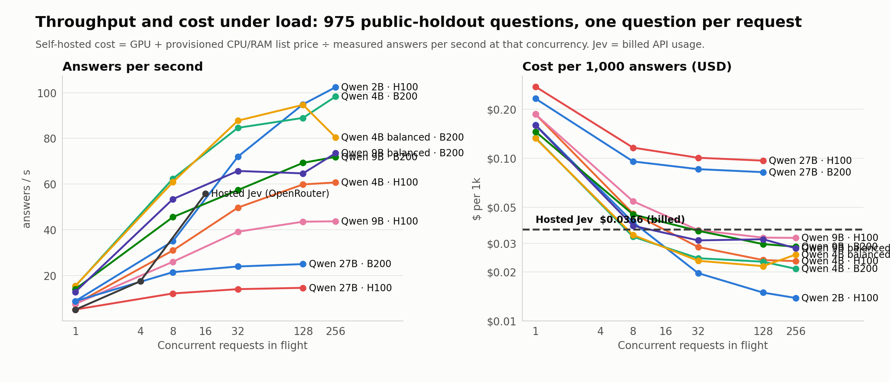
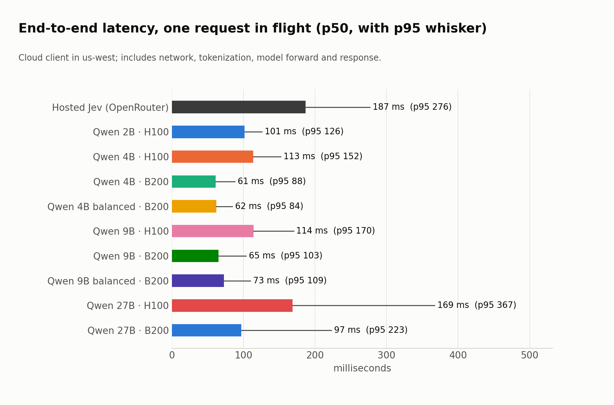
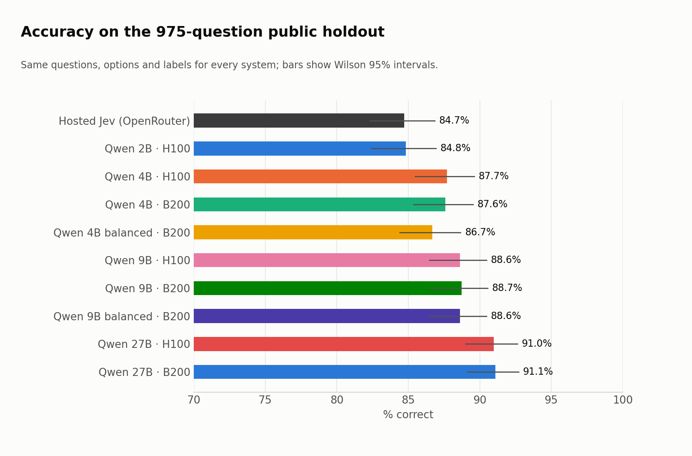

# Beating Jev with open weights: final comparison

Same 975-question public holdout for every system (ContractNLI, RACE, CosmosQA, MultiRC, Social IQa; never trained on). One question per request. Cloud client in us-west. Hosted Jev = `typesafe/jev-1.13` via OpenRouter, billed cost from the API. Self-hosted = Qwen backbone + rank-16 LoRA + pointer head, merged BF16 weights, served with cross-request dynamic batching on one Modal GPU; cost = GPU + provisioned CPU/RAM list price ÷ measured answers per second at that concurrency (no idle time, no startup).

## Headline: best operating point per system

| System | Accuracy (975) | 95% CI | p50 latency, 1 in flight | Best throughput | Cost / 1k answers at best throughput | vs Jev cost |
|---|---:|---:|---:|---:|---:|---:|
| Hosted Jev (OpenRouter) | 84.7% | 82.3–86.8 | 187 ms | 56/s @ c=16 (client-limited) | $0.0366 | — |
| Qwen3.5-2B + head · H100 | **84.8%** | 82.4–86.9 | 101 ms | 102/s @ c=256 | $0.0138 | 2.6x cheaper |
| Qwen3.5-4B + head · H100 | **87.7%** | 85.5–89.6 | 113 ms | 61/s @ c=256 | $0.0233 | 1.6x cheaper |
| Qwen3.5-4B + head · B200 | **87.6%** | 85.4–89.5 | 61 ms | 98/s @ c=256 | $0.0209 | 1.8x cheaper |
| Qwen3.5-4B balanced + head · B200 | **86.7%** | | 62 ms | 95/s @ c=128 | $0.0217 | 1.7x cheaper |
| Qwen3.5-9B + head · H100 | **88.6%** | 86.5–90.5 | 114 ms | 44/s @ c=256 | $0.0324 | 1.1x cheaper |
| Qwen3.5-9B + head · B200 | **88.7%** | 86.6–90.6 | 65 ms | 72/s @ c=256 | $0.0286 | 1.3x cheaper |
| Qwen3.5-9B balanced + head · B200 | **88.6%** | | 73 ms | 73/s @ c=256 | $0.0279 | 1.3x cheaper |
| Qwen3.8-27B + head · H100 | **91.0%** | 89.0–92.6 | 169 ms | 15/s @ c=128 | $0.0967 | 2.6x more expensive |
| Qwen3.8-27B + head · B200 | **91.1%** | 89.1–92.7 | 97 ms | 25/s @ c=128 | $0.0821 | 2.2x more expensive |

Accuracy is from the concurrency-1 pass; every other level re-answered all 975 questions and matched to within a few near-tied answers (see per-level table). Jev throughput is limited by how many requests the client kept in flight, not by Jev.

## Every concurrency level

| Arm | GPU | Conc. | Accuracy | p50 ms | p95 ms | Answers/s | GPU busy | Cost / 1k |
|---|---|---:|---:|---:|---:|---:|---:|---:|
| jev | hosted | 1 | 84.72% | 187 | 276 | 5.1 |  | $0.0366 |
| jev | hosted | 4 | 85.23% | 182 | 498 | 17.5 |  | $0.0366 |
| jev | hosted | 16 | 84.92% | 197 | 577 | 55.8 |  | $0.0366 |
| small2h | NVIDIA H100 80GB HBM3 | 1 | 84.82% | 101 | 126 | 8.8 | 35% | $0.1606 |
| small2h | NVIDIA H100 80GB HBM3 | 8 | 84.82% | 191 | 367 | 35.0 | 87% | $0.0404 |
| small2h | NVIDIA H100 80GB HBM3 | 32 | 84.82% | 417 | 729 | 72.0 | 95% | $0.0196 |
| small2h | NVIDIA H100 80GB HBM3 | 128 | 84.82% | 1053 | 1976 | 94.9 | 91% | $0.0149 |
| small2h | NVIDIA H100 80GB HBM3 | 256 | 84.82% | 1817 | 2850 | 102.4 | 97% | $0.0138 |
| small4h | NVIDIA H100 80GB HBM3 | 1 | 87.69% | 113 | 152 | 7.6 | 40% | $0.1866 |
| small4h | NVIDIA H100 80GB HBM3 | 8 | 87.79% | 240 | 441 | 31.0 | 95% | $0.0457 |
| small4h | NVIDIA H100 80GB HBM3 | 32 | 87.69% | 595 | 1129 | 49.7 | 97% | $0.0285 |
| small4h | NVIDIA H100 80GB HBM3 | 128 | 87.69% | 1854 | 3158 | 59.8 | 96% | $0.0236 |
| small4h | NVIDIA H100 80GB HBM3 | 256 | 87.69% | 3336 | 5413 | 60.7 | 99% | $0.0233 |
| small4b | NVIDIA B200 | 1 | 87.59% | 61 | 88 | 15.3 | 38% | $0.1338 |
| small4b | NVIDIA B200 | 8 | 87.59% | 117 | 217 | 62.4 | 97% | $0.0329 |
| small4b | NVIDIA B200 | 32 | 87.59% | 342 | 645 | 84.6 | 95% | $0.0243 |
| small4b | NVIDIA B200 | 128 | 87.59% | 1149 | 2123 | 88.9 | 92% | $0.0231 |
| small4b | NVIDIA B200 | 256 | 87.59% | 1742 | 3330 | 98.3 | 98% | $0.0209 |
| small9h | NVIDIA H100 80GB HBM3 | 1 | 88.62% | 114 | 170 | 7.6 | 44% | $0.1865 |
| small9h | NVIDIA H100 80GB HBM3 | 8 | 88.72% | 256 | 560 | 26.0 | 89% | $0.0544 |
| small9h | NVIDIA H100 80GB HBM3 | 32 | 88.72% | 762 | 1359 | 39.2 | 99% | $0.0361 |
| small9h | NVIDIA H100 80GB HBM3 | 128 | 88.62% | 2581 | 4343 | 43.6 | 97% | $0.0325 |
| small9h | NVIDIA H100 80GB HBM3 | 256 | 88.72% | 4891 | 7365 | 43.7 | 99% | $0.0324 |
| small9b | NVIDIA B200 | 1 | 88.72% | 65 | 103 | 14.1 | 40% | $0.1460 |
| small9b | NVIDIA B200 | 8 | 88.72% | 143 | 341 | 45.6 | 84% | $0.0451 |
| small9b | NVIDIA B200 | 32 | 88.51% | 463 | 1379 | 57.4 | 86% | $0.0358 |
| small9b | NVIDIA B200 | 128 | 88.62% | 1592 | 2664 | 69.3 | 94% | $0.0296 |
| small9b | NVIDIA B200 | 256 | 88.62% | 2815 | 4455 | 71.9 | 98% | $0.0286 |
| dense27h | NVIDIA H100 80GB HBM3 | 1 | 90.97% | 169 | 367 | 5.1 | 62% | $0.2758 |
| dense27h | NVIDIA H100 80GB HBM3 | 8 | 91.08% | 586 | 1246 | 12.2 | 99% | $0.1162 |
| dense27h | NVIDIA H100 80GB HBM3 | 32 | 91.08% | 2149 | 3829 | 14.1 | 100% | $0.1007 |
| dense27h | NVIDIA H100 80GB HBM3 | 128 | 90.97% | 8003 | 13445 | 14.6 | 100% | $0.0967 |
| dense27b | NVIDIA B200 | 1 | 91.08% | 97 | 223 | 8.8 | 54% | $0.2329 |
| dense27b | NVIDIA B200 | 8 | 91.08% | 338 | 703 | 21.5 | 99% | $0.0956 |
| dense27b | NVIDIA B200 | 32 | 91.18% | 1281 | 2223 | 24.0 | 99% | $0.0857 |
| dense27b | NVIDIA B200 | 128 | 91.18% | 4753 | 7810 | 25.0 | 99% | $0.0821 |

## 1 / 5 / 20 questions per request, cache-busted (`multiq_invoice_bust_20260922-174831`)

Four invoice contexts (about 140 tokens) × 20 yes/no questions, sizes 1/5/20, five repetitions, one request in flight, cloud client in us-west. Every request carries a fresh `request_reference` in the state (a dict key for us and for Jev alike) so no side can serve it from a cache. e2e p50 from the client; GPU ms is the server-side forward; network = e2e minus server time (tokenization + transport). The self-hosted path is chosen per request by the calibrated cost model in `server.py` v10 (see Serving notes). Earlier runs without cache-busting (`multiq_20260922-104401`, `multiq_merged`) and the first cache-busted run (`multiq_invoice_bust_20260922-172118`, invalid: the buster stringified the state, which the server then JSON-escaped, and two arms ran on slow hosts) are superseded.

| System | Q/req | Accuracy | e2e p50 | e2e p95 | GPU | prefill | fork | branches | network | path | Jev cost / 1k |
|---|---:|---:|---:|---:|---:|---:|---:|---:|---:|---|---:|
| Hosted Jev (OpenRouter) | 1 | 100.0% | 152 ms | 284 ms | | | | | | | $0.0185 |
| Hosted Jev (OpenRouter) | 5 | 95.0% | 154 ms | 288 ms | | | | | | | $0.0059 |
| Hosted Jev (OpenRouter) | 20 | 91.0% | 160 ms | 292 ms | | | | | | | $0.0035 |
| Qwen3.5-4B LoRA + head · B200 | 1 | 100.0% | 57 ms | 59 ms | 23 ms | | | | 31 ms | rows | |
| Qwen3.5-4B LoRA + head · B200 | 5 | 85.0% | 58 ms | 64 ms | 24 ms | | | | 30 ms | rows | |
| Qwen3.5-4B LoRA + head · B200 | 20 | 79.8% | 86 ms | 91 ms | 49 ms | | | | 31 ms | rows | |
| Qwen3.5-9B LoRA + head · B200 | 1 | 100.0% | 57 ms | 64 ms | 22 ms | | | | 31 ms | rows | |
| Qwen3.5-9B LoRA + head · B200 | 5 | 85.0% | 59 ms | 60 ms | 25 ms | | | | 30 ms | rows | |
| Qwen3.5-9B LoRA + head · B200 | 20 | 82.8% | 103 ms | 115 ms | 68 ms | 25 | 1 | 43 | 31 ms | shared | |
| Qwen3.8-27B LoRA + head · B200 | 1 | 75.0% | 82 ms | 91 ms | 47 ms | | | | 31 ms | rows | |
| Qwen3.8-27B LoRA + head · B200 | 5 | 90.0% | 99 ms | 105 ms | 64 ms | | | | 30 ms | rows | |
| Qwen3.8-27B LoRA + head · B200 | 20 | 95.0% | 198 ms | 204 ms | 163 ms | 52 | 1 | 110 | 31 ms | shared | |

The 2B and the balanced 4B/9B were not rerun with cache-busting; their earlier (non-busted) numbers were 2B 107/109/156 ms, 4B balanced 78/77/101 ms, 9B balanced 81/82/143 ms at 1/5/20 questions.

## Jev's own evaluation set (102 official workflow questions) and a 160-question public slice

Out of distribution for our models: none of the four workflow categories (nor mmlu/paws/qnli/emotion/tweet-offensive) are in our training mix; Jev's labels here are strong-model consensus, not human ground truth. Scored on the deployed servers (`external_eval.py`), Jev from its saved answers on the same rows.

| Arm | Official 102 | invoices 29 | agent traces 28 | customer service 24 | security 21 | Public slice 160 | errors |
|---|---:|---:|---:|---:|---:|---:|---:|
| small2h | **71/102** (69.6%) | 22/29 | 18/28 | 18/24 | 13/21 | 103/160 (64.4%) | 0 |
| small4b | **87/102** (85.3%) | 29/29 | 21/28 | 21/24 | 16/21 | 112/160 (70.0%) | 0 |
| small9b | **84/102** (82.4%) | 28/29 | 20/28 | 23/24 | 13/21 | 115/160 (71.9%) | 0 |
| dense27b | **88/102** (86.3%) | 29/29 | 21/28 | 21/24 | 17/21 | 129/160 (80.6%) | 0 |
| jev | **91/102** (89.2%) | 29/29 | 21/28 | 23/24 | 18/21 | 126/160 (78.8%) | 0 |

## Workflow adaptation attempt (warm start on templated workflow cases)

One extra epoch from the full-data checkpoints on 704 templated security / payables / customer-service / agent-trace decisions (from the earlier session's generator, zero overlap with the official set) plus 2,000 replay rows, at 0.3x learning rate. The templates were learned (98% on their held-out slice) but transfer to Jev's narrative-style official cases is small for the 4B and negative for the 27B, with a slight holdout dip on both. The shipped checkpoints remain the full-data ones; the adapted checkpoints are on the volume under `workflow_20260922-112445_*`.

| Model | Stage | Official 102 | invoices | agent traces | customer service | security | Public 160 | Holdout 975 |
|---|---|---:|---:|---:|---:|---:|---:|---:|
| Qwen/Qwen3.5-4B | baseline | **87/102** | 29/29 | 21/28 | 21/24 | 16/21 | 112/160 |  |
| Qwen/Qwen3.5-4B | trained | **89/102** | 29/29 | 21/28 | 22/24 | 17/21 | 114/160 | 87.5% |
| Qwen/Qwen3.5-4B | workflow templates dev (64) | 84% → 98% | | | | | | |
| Qwen/Qwen3.8-27B | baseline | **89/102** | 29/29 | 21/28 | 21/24 | 18/21 | 129/160 |  |
| Qwen/Qwen3.8-27B | trained | **88/102** | 29/29 | 21/28 | 22/24 | 16/21 | 126/160 | 90.5% |
| Qwen/Qwen3.8-27B | workflow templates dev (64) | 94% → 98% | | | | | | |
| Hosted Jev | saved answers | **91/102** | 29/29 | 21/28 | 23/24 | 18/21 | 126/160 | 84.7% |

## Official-style synthetic data (generator: `synth_workflows.py`)

Packets generated in the exact shape of the four published workflows (accounts-payable review packet with PO / contract / receiving / prior invoices / vendor master / communications / exact_facts; agent policy + entitlements + tool-call trace; support conversation + customer + account_summary; alert + context records), with every label derived by rule from the generated facts and all entities invented. Question wording follows the published question types; no scenario content is taken from the evaluation set. v1: 4,284 decisions / 18 question types. v2: 5,527 decisions adding per-action permission, "what went wrong", "left unaddressed", spread, live-or-finished and persistence. Both warm-start the full-data checkpoints with 2,000 replay rows.

**v1**

| Model | Stage | Official 102 | invoices | agent traces | customer service | security | Public 160 | Holdout 975 |
|---|---|---:|---:|---:|---:|---:|---:|---:|
| Qwen/Qwen3.5-4B | baseline | **87/102** | 29/29 | 21/28 | 21/24 | 16/21 | 112/160 |  |
| Qwen/Qwen3.5-4B | trained | **88/102** | 29/29 | 21/28 | 21/24 | 17/21 | 113/160 | 87.9% |
| Qwen/Qwen3.5-4B | workflow templates dev (64) | 82% → 100% | | | | | | |
| Qwen/Qwen3.8-27B | baseline | **89/102** | 29/29 | 21/28 | 21/24 | 18/21 | 129/160 |  |
| Qwen/Qwen3.8-27B | trained | **87/102** | 29/29 | 19/28 | 23/24 | 16/21 | 129/160 | 91.1% |
| Qwen/Qwen3.8-27B | workflow templates dev (64) | 92% → 100% | | | | | | |
| Hosted Jev | saved answers | **91/102** | 29/29 | 21/28 | 23/24 | 18/21 | 126/160 | 84.7% |

**v2 (extended question types)**

| Model | Stage | Official 102 | invoices | agent traces | customer service | security | Public 160 | Holdout 975 |
|---|---|---:|---:|---:|---:|---:|---:|---:|
| Qwen/Qwen3.5-4B | baseline | **87/102** | 29/29 | 21/28 | 21/24 | 16/21 | 112/160 |  |
| Qwen/Qwen3.5-4B | trained | **89/102** | 29/29 | 22/28 | 21/24 | 17/21 | 115/160 | 87.2% |
| Qwen/Qwen3.5-4B | workflow templates dev (64) | 85% → 100% | | | | | | |
| Qwen/Qwen3.8-27B | baseline | **89/102** | 29/29 | 21/28 | 21/24 | 18/21 | 129/160 |  |
| Qwen/Qwen3.8-27B | trained | **86/102** | 29/29 | 19/28 | 22/24 | 16/21 | 128/160 | 91.6% |
| Qwen/Qwen3.8-27B | workflow templates dev (64) | 91% → 100% | | | | | | |
| Hosted Jev | saved answers | **91/102** | 29/29 | 21/28 | 23/24 | 18/21 | 126/160 | 84.7% |

Outcome: the synthetic packets help the 4B (+2 on the official set, holdout flat) and hurt the 27B (−3, holdout +0.5), which already answers these packets correctly before training and is pushed toward the generator's easier distribution. Shipped: 27B/9B/2B full-data checkpoints; 4B general checkpoint by default with the v2 workflow-tuned checkpoint as an alternate endpoint.

Audit of the 4B v2 misses on the official 102: 13 misses, of which 8 are also missed by Jev (both systems disagree with the consensus label); 5 are ours alone (a refund-plus-cancellation conversation, a DLL-hijack persistence pattern the generator lacks, and two long agent traces); Jev alone misses 3 that we get right. Net: 89 vs 91.

## Kev's released checkpoints as a baseline (`kev_eval.py`)

Kev (jaredpalmer/kev-4b, kev-9b: Qwen3.5-Base + rank-16 LoRA + pointer head, trained on ~12.6k short classification/policy decisions) scored through its own serving path, one question per request, bf16. Its strict mode rejects states over 384 tokens, which excludes 312 of the 975 holdout rows (all of ContractNLI) and 76 of the 102 official questions (all invoices and security cases, 26 of 28 agent traces). Errors count as wrong in the first table.

| Checkpoint | Holdout 975 | Official 102 | Public 160 | rows rejected (>384 tokens) |
|---|---:|---:|---:|---:|
| Kev-4B | 506/975 (51.9%) | 23/102 | 121/160 | 388 of 1,237 |
| Kev-9B | 535/975 (54.9%) | 24/102 | 124/160 | 388 of 1,237 |

On the 663 holdout rows Kev-9B could score (short states only), every system on identical questions:

| Model | Kev-scorable subset (663) | Full 975 |
|---|---:|---:|
| Kev-9B | 80.7% | rejects 312 |
| Hosted Jev | 86.0% | 84.7% |
| Qwen 2B + head (ours) | 84.0% | 84.8% |
| Qwen 4B + head (ours) | 87.2% | 87.6% |
| Qwen 9B + head (ours) | 88.7% | 88.7% |
| Qwen 27B + head (ours) | 91.6% | 91.1% |

Kev-9B is 8 points below our 9B on the same questions and 5 below Jev. Where Kev is trained in-distribution (the public-task slice: classification families from its own training suite) it scores 124/160, close to Jev's 126 and above our 4B/9B, which confirms the transfer gap on that slice is a training-mix choice, not a model limit.

With the 384-token guard lifted (`KEV_STRICT=0`; 9 rows still fail on over-long option lists), Kev scores every packet but degrades on long states (68% on the 379 previously rejected rows):

| Checkpoint | Holdout 975 | Official 102 | invoices | agent traces | customer service | security | Public 160 |
|---|---:|---:|---:|---:|---:|---:|---:|
| Kev-4B, guard lifted | 73.4% | 71/102 | 19/29 | 16/28 | 21/24 | 15/21 | 121/160 |
| Kev-9B, guard lifted | 76.5% | 72/102 | 19/29 | 16/28 | 22/24 | 15/21 | 124/160 |
| Hosted Jev | 84.7% | 91/102 | 29/29 | 21/28 | 23/24 | 18/21 | 126/160 |
| Qwen 4B + head (ours, v2) | 87.2% | 89/102 | 29/29 | 22/28 | 21/24 | 17/21 | 115/160 |

## Head-only ablation (`head_only.py`)

Frozen Qwen3.5-4B, no LoRA: one forward pass caches the hidden vectors at each option's last token and the decision token at layers 8/16/24/32 (7 minutes for 19.6k training rows on a B200), then a 256-d pointer head (with a LayerNorm on the input) trains on the cached features in about 10 seconds per configuration.

| Head on layer(s) | Holdout 975 | Official 102 | Public 160 |
|---|---:|---:|---:|
| 32 (final) | 80.5% | 64 | 105 |
| 24 | **83.6%** | 58 | 106 |
| 16 | 81.1% | 59 | 85 |
| 8 | 55.3% | 39 | 68 |
| 24 + 32 | 81.4% | 62 | 98 |
| 16 + 24 + 32 | 81.3% | 63 | 104 |
| LoRA + head (shipped 4B) | 87.6% | 87 | 112 |
| Hosted Jev | 84.7% | 91 | 126 |

A head on layer 24 reaches 83.6% in-distribution (the finer sweep below puts the peak at layer 18, 84.3%), within a point of Jev, with training cost measured in seconds; mid-spine features beat the final layer by 3 to 4 points. Out of distribution (Jev's official set) head-only collapses to 58–64 of 102 versus 87 with the adapter, so the LoRA is what buys transfer, not in-distribution accuracy.

**Per-layer sweep** (one head per layer, same frozen 4B, same recipe): the best single layer is 18 to 20, just past the midpoint of the 32-layer stack, and it is best on all three sets at once. Layers above 21 decline steadily toward the final layer.

| Layer | Holdout 975 | Official 102 | Public 160 |
|---:|---:|---:|---:|
| 12 | 67.1% | 45 | 75 |
| 13 | 72.7% | 57 | 86 |
| 14 | 79.2% | 57 | 83 |
| 15 | 81.5% | 58 | 86 |
| 16 | 80.7% | 59 | 90 |
| 17 | 81.2% | 64 | 101 |
| 18 | 84.3% | 70 | 98 |
| 19 | 83.7% | 74 | 100 |
| 20 | 83.9% | 65 | 103 |
| 21 | 82.8% | 56 | 114 |
| 22 | 81.9% | 60 | 110 |
| 23 | 82.9% | 61 | 107 |
| 24 | 83.1% | 56 | 104 |
| 25 | 83.3% | 60 | 103 |
| 26 | 83.6% | 60 | 98 |
| 27 | 82.7% | 54 | 97 |
| 28 | 82.6% | 48 | 106 |
| 29 | 82.9% | 44 | 98 |
| 30 | 82.7% | 55 | 100 |
| 31 | 81.3% | 58 | 103 |
| 32 | 80.6% | 57 | 98 |

**Learned layer mixes** (softmax weight per layer, per-layer LayerNorm, same head; separate feature pass so single-layer controls re-run):

| Config | Holdout 975 | Official 102 | Public 160 | Learned weights |
|---|---:|---:|---:|---|
| layer 18 (control) | 83.3% | 66 | 101 | |
| layer 19 (control) | 83.2% | 68 | 105 | |
| mix of 17–21 | 83.8% | 61 | 103 | near-uniform (0.19–0.23) |
| mix of 14–24 | 83.6% | 63 | 98 | near-uniform |
| mix of 12–32 | 84.6% | 63 | 102 | near-uniform (0.04–0.07 each) |
| mix of 18, 20, 24, 28, 32 | 83.0% | 66 | 104 | L18 0.27, L32 0.24, L20 0.20 |

Mixing layers does not beat the best single layer beyond run-to-run noise (about ±1 point from head initialization and shuffle order): the learned weights stay near-uniform rather than concentrating, and the official-set score is no better. The head-only ceiling on this backbone is roughly 84% in-distribution and 65–75 of 102 out of distribution, regardless of how the layers are combined; the LoRA is what lifts those to 87.6% and 87.

## Snake arena (`snake_arena.py`, replay in `snake_20260922-152547/replay.html`)

A game none of the systems was trained on: each tick the player sees the same board text (coordinates, body, food, ASCII grid) and answers one four-way `choice` question. Identical seeds per game; decisions made from a cloud client in us-west (Jev via OpenRouter).

10 games per player, 10x10 grid, up to 200 steps, identical seeds. One `choice` question per tick (up/down/left/right) from the same board text. Ranked by total food eaten; steps survived as tie-break.

| Player | Food total | Food / game | Best game | Steps / game | Deaths | Median decision | Cost |
|---|---:|---:|---:|---:|---|---:|---:|
| Qwen 27B + head | **173** | 17.3 | 26 | 151 | self 7, timeout 3 | 98 ms | — |
| Hosted Jev | **110** | 11.0 | 21 | 79 | self 10 | 170 ms | $0.0207 |
| Qwen 9B + head | **60** | 6.0 | 16 | 100 | self 8, starved 2 | 95 ms | — |
| Qwen 4B + head | **29** | 2.9 | 11 | 72 | starved 5, self 5 | 96 ms | — |

**Rerun with the full rules in the question** (movement, death on wall or any body cell including the neck, growth on food, goal of surviving as long as possible while eating); replay in `snake_20260922-153431/replay.html`:

10 games per player, 10x10 grid, up to 200 steps, identical seeds. One `choice` question per tick (up/down/left/right) from the same board text. Ranked by total food eaten; steps survived as tie-break.

| Player | Food total | Food / game | Best game | Steps / game | Deaths | Median decision | Cost |
|---|---:|---:|---:|---:|---|---:|---:|
| Qwen 27B + head | **185** | 18.5 | 26 | 161 | timeout 4, self 6 | 99 ms | — |
| Hosted Jev | **122** | 12.2 | 23 | 89 | self 10 | 195 ms | $0.0265 |
| Qwen 9B + head | **103** | 10.3 | 16 | 136 | self 7, starved 1, timeout 2 | 95 ms | — |
| Qwen 4B + head | **78** | 7.8 | 14 | 146 | timeout 3, starved 4, self 3 | 96 ms | — |

## Balanced training mix (`prepare_balanced.py`, `balanced_20260922-144201`)

Same recipe, retrained from scratch on 21,781 decisions: reading comprehension capped at 2,500 per family (contractnli 2,000), Kev's full decision-v3 public suite (3,900 rows of classification and policy/logic), and 1,000 rows each from the train splits of the five families that previously only appeared in the transfer slice (MMLU validation, PAWS, QNLI, emotion, tweet offensiveness), formatted exactly like the slice and checked against both frozen evaluation sets.

| Model | Holdout 975 | Official 102 | invoices | agent traces | customer service | security | Public 160 |
|---|---:|---:|---:|---:|---:|---:|---:|
| 4B general (19.8k mix) | 87.6% | 87 | 29/29 | 21/28 | 21/24 | 16/21 | 112 |
| **4B balanced** | 86.6% | 88 | 27/29 | 22/28 | 22/24 | 17/21 | **121** |
| Hosted Jev | 84.7% | 91 | 29/29 | 21/28 | 23/24 | 18/21 | 126 |

| 9B general (19.8k mix) | 88.7% | 84 | 28/29 | 20/28 | 23/24 | 13/21 | 115 |
| **9B balanced** | 88.6% | 83 | 28/29 | 21/28 | 21/24 | 13/21 | **124** |

The rebalance moves the transfer slice by +9 for both sizes (4B 112 → 121, 9B 115 → 124; Jev 126, Kev-9B 124) at a cost of one point on the holdout for the 4B and none for the 9B. The official set is unchanged within noise.

**Final text-board run, foresight instruction added** ("does not paint the snake into a corner later: avoid moves that lead into dead ends or pockets enclosed by walls and your own body, and keep an open path back to free space"); replay in `snake_20260922-161608/replay.html`:

10 games per player, 10x10 grid, up to 200 steps, identical seeds. One `choice` question per tick (up/down/left/right) from the same board text. Ranked by total food eaten; steps survived as tie-break.

| Player | Food total | Food / game | Best game | Steps / game | Deaths | Median decision | Cost |
|---|---:|---:|---:|---:|---|---:|---:|
| Qwen 27B + head | **189** | 18.9 | 23 | 176 | self 5, timeout 5 | 96 ms | — |
| Hosted Jev | **113** | 11.3 | 21 | 88 | starved 2, self 8 | 168 ms | $0.0275 |
| Qwen 9B + head | **107** | 10.7 | 15 | 138 | self 8, timeout 2 | 68 ms | — |
| Qwen 4B + head | **101** | 10.1 | 15 | 148 | self 5, starved 3, timeout 2 | 127 ms | — |

**Board as an image** (`snake_vision.py`, `vision_server.py`): the same games with the board sent as a PNG through the models' own vision towers; the text carries only the rules, grid size, current direction and length. The text-trained LoRA and head have never seen image tokens. Jev cannot take images, so it has no entry here.

10 games per player, 10x10 grid, up to 200 steps, identical seeds. One `choice` question per tick (up/down/left/right) from the same board text. Ranked by total food eaten; steps survived as tie-break.

| Player | Food total | Food / game | Best game | Steps / game | Deaths | Median decision | Cost |
|---|---:|---:|---:|---:|---|---:|---:|
| Qwen 27B + head (image board) | **66** | 6.6 | 14 | 64 | self 8, wall 1, starved 1 | 158 ms | — |
| Qwen 9B + head (image board) | **19** | 1.9 | 4 | 14 | self 7, wall 3 | 102 ms | — |
| Qwen 4B + head (image board) | **17** | 1.7 | 4 | 11 | self 7, wall 3 | 73 ms | — |

**Three questions per tick, 27B, image board** (`snakevis3q_20260922-160614`): the move question drives the game; two diagnostic questions are scored against the rules but do not affect play. 588 ticks over 10 games.

| Question | Options | Accuracy | Chance |
|---|---|---:|---:|
| Which direction should the snake move? (game score) | 4 | 60 food / 10 games, 59 steps per game | text-board 27B: 185 |
| Which move is most likely to kill the snake? | 4 directions + "none" | 5.8% | 20% |
| Which two-move sequence is best? | 8 sequences (4 straight, 4 L-turns) | 69.0% | ~25% |

The kill question exposes a specific blind spot: reversing into the neck is always fatal, so a deadly move exists on every tick, yet the model answered "none" on 502 of 588 ticks. The two-move plan question is answered well above chance (69%), and its first move agrees with the actual move on 60% of ticks.

## Long-context multi-question run, cache-busted: 17 claims on a 2k-token contract (`multiq_contract_bust_20260922-180318`)

Four ContractNLI test-split documents (1,900–2,900 tokens; no overlap with training or the holdout), the 17 standard claims each, sizes 1/5/17, five repetitions, one request in flight, same cache-busting as above (a suffix line on the string state). Requests with ≥3 questions take the shared-context path here: prefill once, fork the cache (attention KV + DeltaNet recurrent state) per question, one batched branch forward. Verified against independent rows: 100% choice agreement, max |Δp| 0.03. Supersedes `multiq_contract_clean_20260922-164533` (no cache-busting) and `multiq_contract_bust_20260922-170100` (blocked event loop on the 27B); an earlier run on train-split documents (`multiq_contract_20260922-164253`) is superseded because 18 of its 68 (document, claim) pairs were in our training set.

| System | Q/req | Accuracy | e2e p50 | e2e p95 | GPU | prefill | fork | branches | network | path |
|---|---:|---:|---:|---:|---:|---:|---:|---:|---:|---|
| Hosted Jev (OpenRouter) | 1 | 100.0% | 114 ms | 252 ms | | | | | | |
| Hosted Jev (OpenRouter) | 5 | 65.0% | 130 ms | 307 ms | | | | | | |
| Hosted Jev (OpenRouter) | 17 | 75.0% | 137 ms | 205 ms | | | | | | |
| Qwen3.5-4B LoRA + head · B200 | 1 | 100.0% | 55 ms | 75 ms | 33 ms | | | | 16 ms | rows |
| Qwen3.5-4B LoRA + head · B200 | 5 | 80.0% | 85 ms | 95 ms | 59 ms | 33 | 1 | 25 | 15 ms | shared |
| Qwen3.5-4B LoRA + head · B200 | 17 | 85.3% | 132 ms | 155 ms | 80 ms | 34 | 1 | 45 | 22 ms | shared |
| Qwen3.5-9B LoRA + head · B200 | 1 | 100.0% | 68 ms | 78 ms | 42 ms | | | | 21 ms | rows |
| Qwen3.5-9B LoRA + head · B200 | 5 | 85.0% | 96 ms | 113 ms | 68 ms | 42 | 1 | 25 | 17 ms | shared |
| Qwen3.5-9B LoRA + head · B200 | 17 | 85.0% | 143 ms | 167 ms | 94 ms | 42 | 1 | 51 | 19 ms | shared |
| Qwen3.8-27B LoRA + head · B200 | 1 | 100.0% | 152 ms | 197 ms | 127 ms | | | | 19 ms | rows |
| Qwen3.8-27B LoRA + head · B200 | 5 | 85.0% | 220 ms | 273 ms | 188 ms | 125 | 2 | 61 | 20 ms | shared |
| Qwen3.8-27B LoRA + head · B200 | 17 | 86.8% | 319 ms | 365 ms | 269 ms | 127 | 2 | 140 | 19 ms | shared |

Without the shared path, 17 independent rows cost 426 ms of GPU on the 4B, 588 ms on the 9B and 1.9 s on the 27B (measured directly on the same containers). The network residual differs between the two runs (30 ms vs 15–22 ms) because each run's client is a fresh Modal container; compare within a run.

## Training

One epoch of LoRA (rank 16, attention/DeltaNet projections) + 256-d pointer head on the 19,792-decision public mix (rows ≤4096 tokens kept), paired option orders with a KL consistency term, one B200 each. Holdout accuracy during training (never used for selection; final checkpoint used):

| Model | 4,096 ex | 8,192 ex | 12,288 ex | 16,384 ex | Final | Final, options shuffled | Train time |
|---|---:|---:|---:|---:|---:|---:|---:|
| Qwen/Qwen3.5-2B | 76.6% | 81.3% | 82.7% | 82.3% | **84.8%** | 84.2% | 30 min |
| Qwen/Qwen3.5-4B | 83.0% | 85.7% | 87.3% | 87.4% | **87.9%** | 87.8% | 28 min |
| Qwen/Qwen3.5-9B | 87.0% | 88.1% | 88.3% | 88.7% | **88.6%** | 88.8% | 33 min |
| Qwen/Qwen3.8-27B | 89.3% | 90.4% | 90.5% | 91.2% | **91.2%** | 91.0% | 94 min |

## Serving notes

- Right padding on a causal model needs no attention mask for the positions read; masked vs unmasked outputs were identical on 40 mixed-length rows (`/parity`).
- Triton autotunes fla's DeltaNet kernels per (batch, length) key, ~8 s each; the server reuses the first tuned config per kernel for new keys and pre-warms a fixed set of batch sizes (`server.py`).
- Length-sorted, marginal-cost sub-batching (16-token rounding). Padding + per-forward overhead still cost ~20–30% versus the 52k tokens/s (B200) / 30k tokens/s (H100) forward ceiling; sequence packing would recover most of that.
- Path selection (`server.py` v10): at startup each container times a 1-row and a 16-row 256-token forward and two forked calls, giving a per-forward fixed cost, a per-token cost and a per-branch fork cost. `/score` estimates both paths from those and takes the cheaper one (floors: ≥3 questions, ≥64-token state). Measured: 4B fixed 20 ms / 0.009 ms per token, 9B 18 ms / 0.016, 27B 29 ms / 0.056; fork 0.08–0.18 ms per branch.
- Rows of one request are enqueued under one lock acquisition; with per-row enqueues the 2 ms batching window closed mid-request and a 20-question request ran as two forwards. The marginal-cost threshold is 1,024 padded tokens (was 256, which split 20 rows across 16-token length buckets). GPU work for the shared path runs in a worker thread so the event loop keeps HTTP keep-alive (the earlier bimodal 27B network residual).
- Slow-host guard: eager one-in-flight latency is CPU launch-bound. Containers on GCP us-west hosts ran a fixed Python loop in ~80 ms versus ~40 ms on Seattle hosts, and their single-row forward took 2x longer (4B 51 vs 23 ms, 27B 99 vs 46 ms). A container that measures >60 ms at startup raises before loading weights, up to three times per checkpoint (counter on the runs volume), and the host CPU benchmark, GPU clocks, region and cloud are recorded in `/ping` metadata.
- Cost excludes startup (~40–120 s), idle time, and any provider margin; it is the operating cost of a saturated GPU at Modal list price, checked 2026-09-22.

